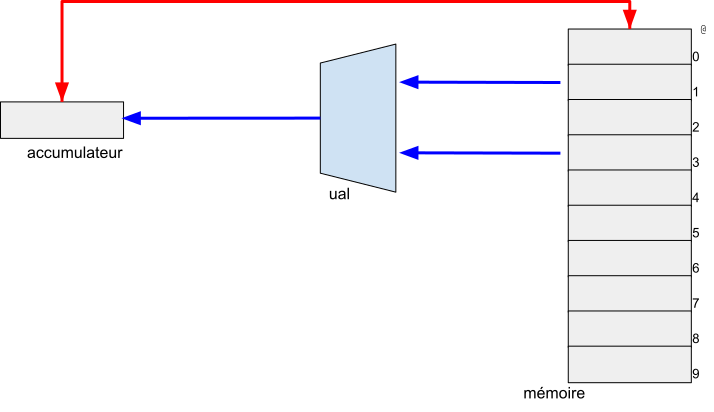

1.- M-10, la machine débranchée
==============================

Dans cette première partie, une brêve présentation d'une machine informatique élémentaire nommée M-10 et la proposition de programmes pour cette machine permettent une première découverte de ce qu'est un ordinateur. 

Cette présentation peut faire l'objet d'un atelier au cours duquel on distribuera une machine, impression du fichier [m10.png](m10.png) (généré à partir de [m10.svg](m10.svg)).

La petite machine débranchée
----------------------------

M-10 est une petite machine informatique constituée

* d'une mémoire qui contient des données, 
* d'une UAL, unité arithmétique et logique capable de réaliser une opération telle une addition,
* d'un accumulateur qui recevra le résultat des opérations réalisées par l'UAL. 

La mémoire est composée de 10 "cases". Ces cases sont numérotées de 0 à 9. Ce numéro est l'adresse de la case.




Jeu d'instructions
------------------

La petite machine M-10 dispose de deux types d'instructions :

* les instructions arithmétiques et logiques réalisées par l'UAL,
* les instructions de transfert entre la mémoire et l'accumulateur.

Les instructions arithmétiques et logiques sont les classiques opérations telles l'addition, la multiplication, ou l'égalité, ou encore le "et logique"... 
Ces opérations prennent leurs opérandes en mémoire.
Ces opérandes sont désignées par leur adresse.
Les instructions produisent leur résultat dans l'accumulateur.

Ainsi, l'instruction d'addition `ADD @1 @2` va additionner les deux valeurs des "cases" mémoires correpondantes aux adresses indiquées et produire le résultat dans l'accumulateur.

Les instructions `SUB`, `MUL`, `DIV` fonctionnent de la même manière et produisent respectivement la différence, le produit et la division.

Il existe (accessoirement) des opérations `LSS @1 @2`

* plus petit que
* idem pour `EQU`, `NEQ`, `LEQ`, `GTR`, `GEQ`

Les instructions de transfert mémoire permettent de copier la valeur de l'accumulateur vers une case mémoire, ou de copier la valeur d'une case mémoire vers l'accumulateur.
Ces instructions nécessitent donc un opérateur, l'adresse de la case mémoire.

L'instruction `LOAD @` transfert de la mémoire vers l’accumulateur. L'instruction `STORE @` transfert de l’accumulateur vers la mémoire.

Premiers programmes
-------------------

Il s'agit de programmer un "programme de calcul" sur M-10.
Par exemple : 

* choisir un nombre
* soustraire 2 à ce nombre
* multiplier le résultat par 4

Et donc d'écrire une suite d'instructions de M-10 dont l'exécution correpondra à ce programme de calcul.

Essayez !

On en vient à se poser les questions 

* où est le nombre choisi ?
* où est le résultat ?
* comment désigner la valeur 2 ? 

et à y répondre :

* à nous de décider !

On choisit donc

* que la case mémoire d'adresse 0 contient initialement la valeur "choisie"
* que la case mémoire d'adresse 1 contient la valeur 2
* que la case mémoire d'adresse 2 contient la valeur 4
* que le résultat sera dans la case mémoire d'adresse 0


Et de proposer le programme :

```
    SUB 0 1
    STO 0
    MUL 0 2
    STO 0 
```

que l'on peut exécuter pas à pas à partir d'une mémoire dans un état initial donné.

On essaie de programmer un second "programme de calcul", modification du premier :

* choisir un nombre
* soustraire 2 à ce nombre
* multiplier le résultat par 4
* _ajouter le quadruple du nombre de départ_

Notre solution précédente ne peut être reprise en l'état, au moment d'"ajouter le quadruple du nombre de départ", nous ne disposons plus de ce nombre. 
Nous choisissons donc un autre état initial de la mémoire :

* on réserve la case mémoire d'adresse 0 pour la valeur "choisie"
* la case mémoire d'adresse 1 contient la valeur 2
* la case mémoire d'adresse 2 contient la valeur 4
* le résultat sera dans la case mémoire d'adresse 3

Lors de la programmation de la dernière phase, "ajouter le quadruple du nombre de départ", on remarque la nécessité de combiner deux résultats de calculs préalable : le résultat de la phase précédente et le quadruple du nombre de départ. On choisit donc

* de réserver les cases mémoires d'adresse 4 et 5 pour des résultats intermédiaires 

On en vient à proposer le programme :

```
    SUB 0 1
    STO 4
    MUL 4 2
    STO 4 
    MUL 0 2
    STO 5 
    ADD 4 5
    STO 3
```

Il est possible de poursuivre avec la programmation d'autres programmes de calcul :

* effectuer le produit de 3 nombres consécutifs
* etc. 

Faisons le point. M-10 est un ordinateur
----------------------------------------

M-10 est une machine informatique principalement constituée

* d'une mémoire (ainsi qu'un accumulateur, qui est un registre particulier)
* d'une unité de calcul

M-10 est une machine informatique particulière, elle ne réalise par seulement une opération particulière pour laquelle elle aurait été conçue : M-10 est une machine programmable, elle est capable d'exécuter des programmes.

M-10 est un _ordinateur_.

Un ordinateur est constitué d'un _processeur_, son cœur dont le fonctionnement est régit par une _unité de contrôle_ qui

* exécute une à une les instructions du programme


2.- À suivre avec M-10
=====================


* expression, affectation
* programmation haut niveau, compilation
* structures de contrôles
* entrées/sortries 
* sous-routines

Vers M999a

* machine von Neumann
